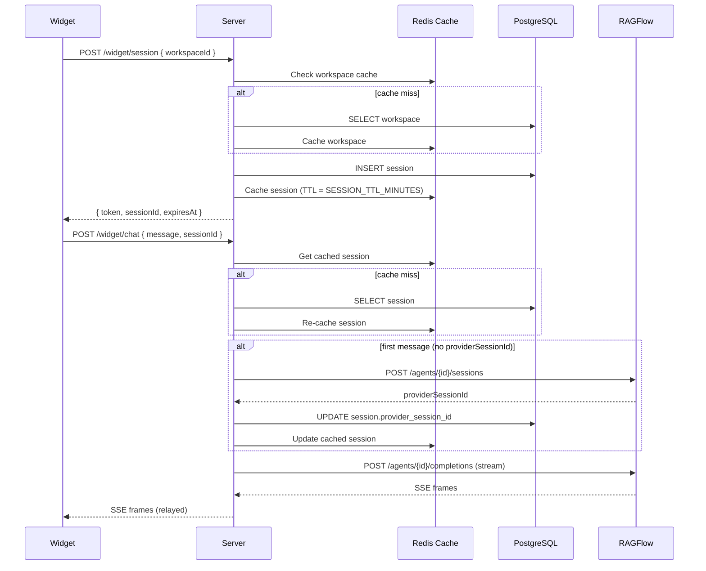

# Agent Toolkit

A production-grade toolkit for embedding RAGFlow-powered chat widgets into web applications. The RAGFlow API key never leaves the server — all communication is proxied through a secure backend.

```
[Browser Widget]                    [Your Backend (BFF)]               [RAGFlow Server]
  workspaceId ──► POST /widget/session ──► JWT token
  Bearer token ──► POST /widget/chat ────► RAGFlow API (secret key) ──► Agent
                   ◄── SSE stream ◄───────── SSE stream ◄──────────────
```

## Packages

| Package                 | Description                                                                                     |
| ----------------------- | ----------------------------------------------------------------------------------------------- |
| `@agent-toolkit/core`   | Runtime-independent shared logic for validation, encryption, provider URLs, and embed templates |
| `@agent-toolkit/server` | Fastify backend — session management, auth, rate limiting, SSE proxy                            |
| `@agent-toolkit/widget` | React hook + drop-in chat component                                                             |
| `@agent-toolkit/cli`    | End-user CLI for workspace, widget, chat, usage, session, and ingest features                   |
| `@agent-toolkit/types`  | Shared TypeScript types, enums, and DTOs                                                        |

### Tools

| Tool                   | Language | Description                                                                                                                                                                      |
| ---------------------- | -------- | -------------------------------------------------------------------------------------------------------------------------------------------------------------------------------- |
| `ragflow_kb_generater` | Python   | Ingest pipeline — crawls Google Drive HR documents, OCRs flowcharts via VLM, generates form metadata cards via LLM, and uploads structured Markdown into RAGFlow knowledge bases |

## Quick Start

### Prerequisites

- Node.js >= 22
- pnpm >= 9
- PostgreSQL 15+
- Redis 7+
- Python >= 3.11 _(only for `tools/ragflow_kb_generater`)_

### Quick Install (recommended)

Run the one-liner to clone, install dependencies, generate secrets, and start infrastructure automatically:

```bash
curl -fsSL https://raw.githubusercontent.com/NewPineTech/agent-toolkit/main/install.sh | bash
```

To install into a custom directory:

```bash
AGENT_TOOLKIT_DIR=my-project curl -fsSL https://raw.githubusercontent.com/NewPineTech/agent-toolkit/main/install.sh | bash
```

### Manual Setup

### 1. Clone and install

```bash
git clone <repo-url> && cd agent-toolkit
pnpm install
```

The installer links the CLI as `agent-toolkit ...` and `atk ...`. From a manual source checkout, run `pnpm link --global` once after `pnpm install` to expose the same short commands.

### 2. Start infrastructure

```bash
docker compose up -d postgres redis
```

### 3. Configure environment

```bash
cp .env.example .env
# Edit .env with your values
```

Required variables:

| Variable         | Description                                                            |
| ---------------- | ---------------------------------------------------------------------- |
| `DATABASE_URL`   | PostgreSQL connection string                                           |
| `REDIS_URL`      | Redis connection string                                                |
| `JWT_SECRET`     | HMAC secret for session tokens (min 32 chars)                          |
| `ENCRYPTION_KEY` | AES-256 key for encrypting provider API keys (64-character hex string) |

Optional variables (with defaults):

| Variable              | Default       | Description                                   |
| --------------------- | ------------- | --------------------------------------------- |
| `PORT`                | `3000`        | Server port                                   |
| `HOST`                | `0.0.0.0`     | Bind address                                  |
| `LOG_LEVEL`           | `info`        | `fatal` `error` `warn` `info` `debug` `trace` |
| `SESSION_TTL_MINUTES` | `30`          | Widget session lifetime                       |
| `CORS_MAX_AGE`        | `86400`       | CORS preflight cache (seconds)                |
| `SHUTDOWN_TIMEOUT_MS` | `30000`       | Graceful shutdown timeout                     |
| `NODE_ENV`            | `development` | `development` `production` `test`             |

### 4. Run the server

```bash
pnpm dev
```

### 5. Embed the widget

```bash
npm install @agent-toolkit/widget
```

```tsx
import { AgentChatWidget } from "@agent-toolkit/widget";

function App() {
  return (
    <AgentChatWidget
      workspaceId="ws_abc123"
      botName="Assistant"
      theme={{ primaryColor: "#D4775A", position: "bottom-right" }}
    />
  );
}
```

> **Note:** The widget resolves its backend URL from the `WIDGET_API_URL` environment variable at build time. Set it in your bundler config (e.g., Vite `define`, webpack `DefinePlugin`) or `.env` file.

### 6. Embed via iframe (no React required)

**Option A — Direct iframe tag:**

````html
Use the CLI so the iframe markup stays aligned with the shared embed template:
```bash agent-toolkit widget iframe ws_abc123 --api-url
https://api.yourdomain.com
````

````

**Option B — Script tag (auto-init):**

```html
<script
  src="https://cdn.yourdomain.com/embed.global.js"
  data-workspace-id="ws_abc123"
  data-primary-color="#D4775A"
  data-width="400px"
  data-height="600px"
></script>
````

**Option C — Programmatic:**

```ts
import { createChatIframe } from "@agent-toolkit/widget/embed";

const iframe = createChatIframe({
  workspaceId: "ws_abc123",
  theme: { primaryColor: "#D4775A" },
});
document.getElementById("chat-container").appendChild(iframe);
```

**Option D — Get HTML snippet:**

```ts
import { getEmbedSnippet } from "@agent-toolkit/widget/embed";

const html = getEmbedSnippet({
  workspaceId: "ws_abc123",
});
// Returns the same shared resize snippet template used by the CLI.
```

#### Embed query parameters

| Parameter         | Description                             |
| ----------------- | --------------------------------------- |
| `workspaceId`     | _Required_. Public workspace identifier |
| `primaryColor`    | Theme primary color (hex)               |
| `backgroundColor` | Theme background color (hex)            |
| `textColor`       | Theme text color (hex)                  |
| `title`           | Bot name displayed in header            |
| `subtitle`        | Header subtitle text                    |
| `placeholder`     | Input placeholder text                  |
| `greeting`        | Welcome greeting text                   |
| `suggestions`     | Comma-separated suggestion strings      |

Or use the headless hook for full UI control:

```tsx
import { useAgentChat } from "@agent-toolkit/widget/hook";

function CustomChat() {
  const { messages, sendMessage, isLoading, isReady, resetSession, error } =
    useAgentChat({
      workspaceId: "ws_abc123",
    });

  return (
    <div>
      {messages.map((msg) => (
        <div key={msg.id}>{msg.content}</div>
      ))}
      <input
        onKeyDown={(e) => {
          if (e.key === "Enter") {
            sendMessage(e.currentTarget.value);
            e.currentTarget.value = "";
          }
        }}
        disabled={!isReady || isLoading}
      />
    </div>
  );
}
```

## Project Structure

```
agent-toolkit/
├── packages/
│   ├── server/                      # @agent-toolkit/server
│   │   ├── src/
│   │   │   ├── adapters/
│   │   │   │   ├── chat/            # Chat provider implementations (RAGFlow)
│   │   │   │   ├── infra/           # Health checks, rate limiters, logging, session cache
│   │   │   │   ├── security/        # AES encryption, JWT tokens, domain validation
│   │   │   │   └── storage/         # Postgres stores, Redis caches
│   │   │   ├── config/              # Zod-validated environment configuration
│   │   │   ├── db/                  # Drizzle ORM schema and migrations
│   │   │   ├── factories/           # Object creation (sessions, tokens, workspaces, errors)
│   │   │   ├── interfaces/          # Port definitions (10 interfaces)
│   │   │   ├── routes/              # Fastify route handlers (widget, health, embed)
│   │   │   ├── app.ts               # DI container setup, plugin registration
│   │   │   └── server.ts            # Entry point, graceful shutdown
│   │   └── drizzle/                 # SQL migration files
│   ├── widget/                      # @agent-toolkit/widget
│   │   ├── src/
│   │   │   ├── components/          # AgentChatWidget + Storybook stories
│   │   │   ├── hooks/               # useAgentChat, useTypingEffect
│   │   │   ├── embed-loader.ts      # Script-tag auto-init for non-React sites
│   │   │   └── standalone.tsx       # Self-contained bundle for iframe embed
│   │   └── .storybook/              # Storybook configuration
│   ├── cli/                         # @agent-toolkit/cli
│   │   └── src/                     # End-user CLI commands
│   ├── core/                        # @agent-toolkit/core
│   │   └── src/                     # Shared runtime logic used by CLI, server, and widget
│   └── types/                       # @agent-toolkit/types
│       └── src/                     # Shared enums, domain models, API DTOs, SSE events
├── tools/
│   └── ragflow_kb_generater/        # Python ingest pipeline (standalone)
│       ├── config.example.yaml      # Template — copy to config.yaml
│       ├── requirements.txt
│       ├── scripts/                 # Pipeline step implementations used by the CLI
│       ├── prompts/                 # VLM & LLM prompt templates
│       ├── data/                    # Generated output (CSV, Markdown, PDF)
│       └── logs/                    # Per-step log files
├── docker-compose.yml               # Postgres + Redis + server (dev stack)
├── Dockerfile                       # Multi-stage production build
└── pnpm-workspace.yaml              # Monorepo workspace config
```

## Architecture

### Multi-Tenant Design

Each workspace maps to a RAGFlow agent with its own encrypted API key, allowed domains, rate limits, and auth configuration.

```
workspaces table
  id | provider_type | agent_id | api_key (AES-256-GCM encrypted) | allowed_domains | auth_mode | rate_limit_config
```

### Authentication Modes

**Anonymous** — Widget calls `POST /widget/session` with a `workspaceId`. The server checks the request `Origin` against the workspace's domain allowlist, then issues a short-lived JWT.

**Authenticated** — The customer's backend signs a JWT with a shared HMAC secret. The widget sends this token alongside the `workspaceId`. The server verifies the signature before issuing a session token. This prevents user impersonation (similar to Intercom Identity Verification).

### Shared Core + Adapter Pattern

Runtime-independent rules live in `@agent-toolkit/core` and are reused by the server, CLI, and widget package. This keeps domain allowlist validation, AES-GCM encryption, RAGFlow provider URL construction, workspace option parsing, widget embed URL generation, and iframe/snippet templates consistent across entrypoints.

### Adapter + Factory Pattern

All external dependencies sit behind interfaces. Every complex object is created through a factory.

```
Interfaces (10)            Adapters                        Factories (5)
────────────────           ──────────────────              ──────────────────
ChatProvider          ───► RagflowAdapter                  ChatProviderFactory
SessionStore          ───► PostgresSessionStore            SessionFactory
SessionCache          ───► RedisSessionCache               TokenFactory
                           InMemorySessionCache            WorkspaceFactory
UsageTracker          ───► PostgresUsageTracker            ErrorResponseFactory
RateLimiter           ───► RedisRateLimiter
                           InMemoryRateLimiter
TokenService          ───► JwtTokenService
EncryptionService     ───► AesEncryptionService (@agent-toolkit/core)
DomainValidator       ───► AllowlistDomainValidator (@agent-toolkit/core)
Logger                ───► PinoLoggerAdapter
HealthChecker         ───► CompositeHealthChecker
```

Dependency injection is handled by `@fastify/awilix` — all adapters are singleton-scoped.

### Session Lifecycle

Sessions follow a multi-layer caching strategy to minimize database round-trips:



Provider sessions are created lazily — the first `POST /widget/chat` triggers a RAGFlow session. This avoids wasting provider resources for sessions that never send a message. The widget persists its token in `localStorage` and reuses it until expiry, automatically re-initializing on 401 responses.

### SSE Streaming

The server acts as a transparent SSE proxy:

1. Widget sends `POST /widget/chat` with a Bearer token
2. Server verifies token, enforces rate limits, resolves the provider session
3. Server calls RAGFlow's completion API with the secret key
4. RAGFlow streams SSE frames back; server parses and relays token-by-token
5. Widget reads the stream via `fetch()` + `ReadableStream` (not EventSource, which is GET-only)

RAGFlow sends cumulative answers (each SSE frame contains the full answer so far). The `RagflowAdapter` extracts only the delta by tracking the previous answer length, converting cumulative payloads into incremental token events for the widget.

### Rate Limiting

Rate limiting uses a Redis sorted-set sliding window per workspace + IP combination:

1. Remove all entries outside the current window (`ZREMRANGEBYSCORE`)
2. Add the current request with timestamp as score (`ZADD`)
3. Count entries in the window (`ZCARD`)
4. Set key expiry to the window duration (`PEXPIRE`)

All four operations run in a single Redis pipeline (one round-trip). Each workspace configures its own limits via `rateLimitConfig`:

```json
{ "maxRequests": 30, "windowMs": 60000 }
```

When a request is rate-limited, the server returns `429` with a `Retry-After` header.

### Graceful Shutdown

The server listens for `SIGTERM` and `SIGINT` signals. On receipt, it:

1. Stops accepting new connections
2. Waits for in-flight requests to complete (up to `SHUTDOWN_TIMEOUT_MS`, default 30s)
3. Closes Redis and PostgreSQL connections
4. Exits cleanly

If the timeout is exceeded, the process force-exits with code 1. This ensures safe behavior behind load balancers and in Kubernetes pod lifecycle hooks.

## API Reference

### `POST /widget/session`

Create a chat session and receive a JWT.

**Request:**

```json
{ "workspaceId": "ws_abc123" }
```

**Headers:** `Origin` (checked against domain allowlist for anonymous mode)

**Response:**

```json
{
  "token": "eyJhbG...",
  "sessionId": "sess_xYz...",
  "expiresAt": "2026-04-22T19:00:00.000Z"
}
```

### `POST /widget/chat`

Send a message and receive a streaming response.

**Headers:** `Authorization: Bearer <session-token>`

**Request:**

```json
{ "message": "What is RAGFlow?", "sessionId": "sess_xYz..." }
```

**Response:** `text/event-stream`

```
data: {"type":"token","content":"RAGFlow"}
data: {"type":"token","content":" is a"}
data: {"type":"done","sessionId":"...","providerSessionId":"..."}
```

#### SSE Event Types

The chat stream emits newline-delimited `data:` frames. Each frame is a JSON object with a `type` discriminator:

| Type       | Fields                            | Description                                  |
| ---------- | --------------------------------- | -------------------------------------------- |
| `token`    | `content: string`                 | An incremental text chunk from the assistant |
| `done`     | `sessionId`, `providerSessionId`  | Stream completed successfully                |
| `error`    | `code: string`, `message: string` | Stream-level error (e.g. provider failure)   |
| `metadata` | `data: Record<string, unknown>`   | Optional provider metadata                   |

#### Error Responses

All error responses follow a consistent envelope:

```json
{
  "error": {
    "code": "ERROR_CODE",
    "message": "Human-readable description",
    "requestId": "uuid-v4"
  }
}
```

| Code                 | HTTP | Cause                                                                     |
| -------------------- | ---- | ------------------------------------------------------------------------- |
| `INVALID_WORKSPACE`  | 404  | `workspaceId` not found in database                                       |
| `DOMAIN_NOT_ALLOWED` | 403  | Request `Origin` not in workspace's allowlist                             |
| `INVALID_TOKEN`      | 401  | Missing, malformed, or expired Bearer token                               |
| `INVALID_AUTH`       | 401  | Customer JWT signature verification failed                                |
| `RATE_LIMITED`       | 429  | Workspace + IP exceeded `rateLimitConfig` (includes `Retry-After` header) |
| `MESSAGE_TOO_LONG`   | 400  | Message exceeds workspace's `maxMessageLength`                            |
| `SESSION_NOT_FOUND`  | 404  | Session ID not found in store or cache                                    |
| `SESSION_EXPIRED`    | 401  | Session past its `expiresAt` timestamp                                    |
| `PROVIDER_ERROR`     | 502  | Upstream RAGFlow returned a non-200 response                              |
| `STREAM_ERROR`       | —    | SSE-only: stream interrupted mid-response                                 |
| `VALIDATION_ERROR`   | 400  | Request body failed JSON Schema validation                                |
| `INTERNAL_ERROR`     | 500  | Unhandled server error (details logged, not exposed)                      |

### `GET /health/live`

Always returns `200 { "status": "ok" }`. Use for liveness probes.

### `GET /health/ready`

Returns `200` if PostgreSQL and Redis are reachable, `503` otherwise. Includes per-component latency.

## Development

```bash
pnpm dev          # Start server with hot reload
pnpm build        # Build all packages
pnpm typecheck    # Type-check all packages
pnpm test         # Run all tests
```

### Running with Docker

```bash
docker compose up --build
```

This starts PostgreSQL, Redis, and the server. The server waits for both databases to be healthy before starting.

### Production Deployment

See [DEPLOYMENT.md](./DEPLOYMENT.md) for the full production deployment guide, including Docker Compose setup, secrets configuration, migrations, and architecture details.

### Docker Production Image

The Dockerfile uses a multi-stage build: build stage compiles TypeScript, production stage runs as a non-root user with a health check.

```bash
docker build -t agent-toolkit .
```

### Database Migrations

The server uses [Drizzle ORM](https://orm.drizzle.team/) for schema management. Migrations live in `packages/server/drizzle/`.

```bash
# Generate a new migration after editing packages/server/src/db/schema.ts
cd packages/server && npx drizzle-kit generate

# Apply pending migrations
cd packages/server && npx drizzle-kit migrate
```

### Workspace CLI

```bash
agent-toolkit workspace create \
  --id ws_acme_001 \
  --agent-id 550e8400-e29b-41d4-a716-446655440000 \
  --api-key ragflow-xxxxx \
  --base-url https://ragflow.example.com \
  --domains "https://acme.com,https://app.acme.com" \
  --auth-mode anonymous
```

The CLI encrypts the API key automatically and upserts the workspace (safe to re-run). Common end-user workspace commands:

```bash
agent-toolkit workspace list
agent-toolkit workspace get ws_acme_001
agent-toolkit workspace set-domains ws_acme_001 --domains "https://acme.com,https://app.acme.com"
agent-toolkit workspace set-rate-limit ws_acme_001 --max-requests 60 --window-ms 60000
agent-toolkit workspace rotate-api-key ws_acme_001 --api-key ragflow-new-key
agent-toolkit usage report ws_acme_001
agent-toolkit sessions list ws_acme_001 --active
```

In the production Docker image, the CLI is also linked as `agent-toolkit` and `atk` inside the server container:

```bash
docker compose --env-file .env.prod -f docker-compose.prod.yml exec server atk workspace list
docker compose --env-file .env.prod -f docker-compose.prod.yml exec server atk workspace get ws_acme_001
```

For an interactive full-screen terminal UI that covers the same end-user commands, run:

```bash
atk tui
```

In the production Docker image:
```bash
docker compose --env-file .env.prod -f docker-compose.prod.yml exec server atk tui
```

The TUI starts with feature groups such as workspace, widget, chat, usage, sessions, ingest, and validation, then shows the commands inside the selected group. List screens use `↑`/`↓` to move, `Enter` or `→` to select, `←` to go back, and `q` to quit. Form fields keep draft values while users switch with `↑`/`↓`, use `Enter` to review inputs, and use `Esc` to leave the form and return to the parent command list. Secret fields are hidden while confirming inputs, destructive actions require confirmation, and users can run another command without restarting the app.

### Widget CLI

```bash
agent-toolkit widget iframe ws_acme_001 \
  --api-url https://api.yourdomain.com \
  --title "Acme Assistant" \
  --primary-color "#D4775A"

agent-toolkit widget script ws_acme_001 \
  --api-url https://api.yourdomain.com \
  --initial-open

agent-toolkit chat ask ws_acme_001 "What can you help with?" \
  --api-url https://api.yourdomain.com \
  --origin https://acme.com
```

### Database Schema

```
workspaces
├── id                  text PK          — public workspace identifier (e.g. "ws_abc123")
├── provider_type       text             — "ragflow" (extensible to "dify", "langflow")
├── provider_agent_id   text             — RAGFlow agent UUID
├── provider_api_key    text             — AES-256-GCM encrypted API key
├── provider_base_url   text             — RAGFlow server URL
├── allowed_domains     text[]           — origin allowlist for anonymous auth
├── auth_mode           text             — "anonymous" | "authenticated" | "both"
├── auth_secret         text?            — encrypted HMAC secret (authenticated mode)
├── rate_limit_config   jsonb            — { maxRequests, windowMs }
├── max_message_length  integer          — per-workspace message size cap (default 4000)
├── created_at          timestamptz
└── updated_at          timestamptz

sessions
├── id                  text PK          — server-generated session ID
├── workspace_id        text FK → workspaces(id) ON DELETE CASCADE
├── provider_session_id text?            — lazily created RAGFlow session ID
├── user_id             text?            — from authenticated JWT payload
├── user_fingerprint    text?            — anonymous user tracking
├── metadata            jsonb            — extensible session data
├── created_at          timestamptz
├── last_active_at      timestamptz      — updated on each chat message
└── expires_at          timestamptz      — hard expiry for cleanup

usage (composite PK: workspace_id + date)
├── workspace_id        text FK → workspaces(id) ON DELETE CASCADE
├── date                date             — aggregation day
├── message_count       integer          — daily message counter
└── token_count         integer          — daily token counter
```

Indexes: `sessions` has indexes on `workspace_id`, `(workspace_id, user_fingerprint)`, and `expires_at` for efficient lookup and TTL-based cleanup.

### Storybook

The widget package includes Storybook for visual component development:

```bash
cd packages/widget && pnpm storybook
```

## Testing

142 tests across 21 files.

```bash
# Unit tests only (adapters + factories)
pnpm --filter @agent-toolkit/server run test

# With coverage report
cd packages/server && npx vitest run --coverage
```

| Area                 | Files | Tests | Coverage |
| -------------------- | ----- | ----- | -------- |
| Security adapters    | 3     | 26    | 100%     |
| Infra adapters       | 5     | 28    | 100%     |
| Storage adapters     | 4     | 19    | 100%     |
| Chat adapter         | 1     | 10    | 90%      |
| Factories            | 5     | 29    | 97%      |
| Integration (routes) | 1     | 12    | —        |

## Knowledge Base Ingest Pipeline

The `tools/ragflow_kb_generater` is a standalone Python pipeline that populates RAGFlow knowledge bases with HR documents from Google Drive. It runs independently of the Node.js packages — no cross-dependency.

### Pipeline Steps

```
Google Drive (HR folder)
  │
  ▼
Step 1 ─ Inventory    Crawl folder tree → inventory.csv (~400 files)
  │
  ├──► Step 2 ─ OCR SOP       PNG flowcharts → Markdown via VLM (Gemini / GPT-4o / Claude)
  │
  ├──► Step 3 ─ Form Cards    .doc/.xls templates → metadata Markdown via LLM (GPT-4o-mini)
  │
  └──► Step 3.5 ─ MD→PDF      (optional) Convert Markdown to PDF via WeasyPrint
  │
  ▼
Step 4 ─ Create KBs   Provision 4 empty KBs in RAGFlow (general, documents, forms, sop)
  │
  ▼
Step 5 ─ Upload        Push .md or .pdf files into RAGFlow KBs
  │
  ▼
Step 6 ─ Test          Smoke-test retrieval queries against each KB
```

### 4 Knowledge Bases

| KB             | Content                   | Chunking             | Status      |
| -------------- | ------------------------- | -------------------- | ----------- |
| `sop_kb`       | ~70 OCR'd SOP flowcharts  | Manual (`^## =====`) | Active      |
| `forms_kb`     | ~300 form metadata cards  | Manual (`^# `)       | Active      |
| `general_kb`   | FAQ, company culture      | Manual               | Placeholder |
| `documents_kb` | Contracts, reports, notes | Naive (1000 tokens)  | Placeholder |

### Quick Start (Ingest)

```bash
cd tools/ragflow_kb_generater
python -m venv venv && source venv/bin/activate
pip install -r requirements.txt
cp config.example.yaml config.yaml   # fill in API keys

agent-toolkit ingest run --test --dry-run  # preview the 5-file test pipeline
agent-toolkit ingest run --test            # run the 5-file test pipeline
agent-toolkit ingest run                   # run the full pipeline
```

**Prerequisites:** Python 3.11+, Google Cloud service account with Drive API enabled, and API keys for VLM/LLM providers configured in `config.yaml`. See `tools/ragflow_kb_generater/README.md` for detailed setup.

## Widget Props

### `<AgentChatWidget />`

| Prop          | Type                        | Default                          | Description                                                  |
| ------------- | --------------------------- | -------------------------------- | ------------------------------------------------------------ |
| `workspaceId` | `string`                    | _required_                       | Public workspace identifier                                  |
| `user`        | `{ id, name?, email? }`     | —                                | User info for authenticated mode                             |
| `theme`       | `ChatTheme`                 | —                                | Visual customization                                         |
| `initialOpen` | `boolean`                   | `false`                          | Start with panel open                                        |
| `placeholder` | `string`                    | `Nhập tin nhắn…`                 | Input placeholder                                            |
| `botName`     | `string`                    | `Trợ lý`                         | Bot name displayed in header                                 |
| `subtitle`    | `string`                    | `Chúng tôi luôn sẵn sàng hỗ trợ` | Header subtitle text                                         |
| `greeting`    | `string`                    | —                                | Welcome greeting (enables rich empty state with suggestions) |
| `suggestions` | `string[]`                  | _(built-in Vietnamese prompts)_  | Quick-start suggestion buttons                               |
| `botAvatar`   | `React.ReactNode`           | _(built-in sun-burst SVG)_       | Custom avatar element (SVG, image, icon)                     |
| `autoScroll`  | `boolean`                   | `true`                           | Auto-scroll to bottom while assistant is typing              |
| `onToggle`    | `(isOpen: boolean) => void` | —                                | Called when the chat panel is opened or closed               |
| `onError`     | `(error: Error) => void`    | —                                | Error callback                                               |

### `ChatTheme`

| Property            | Type                            | Default                            |
| ------------------- | ------------------------------- | ---------------------------------- |
| `primaryColor`      | `string`                        | `#D4775A`                          |
| `primaryDeepColor`  | `string`                        | `#8C4A34`                          |
| `primarySoftColor`  | `string`                        | `#FFF0E8`                          |
| `backgroundColor`   | `string`                        | `#FFF8EE`                          |
| `surfaceColor`      | `string`                        | `#FFFDF8`                          |
| `textColor`         | `string`                        | `#1E1B16`                          |
| `textSoftColor`     | `string`                        | `#6E6557`                          |
| `textMuteColor`     | `string`                        | `#A89C88`                          |
| `borderColor`       | `string`                        | `#EFE6D4`                          |
| `borderSoftColor`   | `string`                        | `#F6EFDE`                          |
| `fontFamily`        | `string`                        | `Inter`, system sans-serif stack   |
| `displayFontFamily` | `string`                        | `Instrument Serif`, Georgia, serif |
| `borderRadius`      | `number`                        | `20`                               |
| `position`          | `bottom-right` \| `bottom-left` | `bottom-right`                     |

### `useTypingEffect` Hook

The widget includes a typewriter animation hook that reveals streamed text progressively instead of jumping on each token:

```tsx
import { useTypingEffect } from "@agent-toolkit/widget";

function AnimatedMessage({ content }: { content: string }) {
  const { text, isAnimating } = useTypingEffect(content, {
    charsPerTick: 4, // characters revealed per interval (default: 4)
    intervalMs: 25, // tick interval in milliseconds (default: 25)
  });

  return (
    <p>
      {text}
      {isAnimating ? "▋" : ""}
    </p>
  );
}
```

The hook tracks a cursor position via `useRef` and advances it by `charsPerTick` characters each tick. When the source `fullText` grows (new tokens arrive), animation continues from where it left off. If `fullText` shrinks (session reset), the cursor resets to zero.

## Security Checklist

- [x] RAGFlow API keys encrypted at rest (AES-256-GCM, random IV per encrypt)
- [x] API keys never sent to the browser
- [x] Short-lived JWT session tokens (configurable TTL)
- [x] Origin/domain allowlist for anonymous widget sessions
- [x] HMAC signature verification for authenticated mode
- [x] Sliding-window rate limiting per workspace + IP (Redis sorted sets)
- [x] Message length validation (per-workspace configurable)
- [x] Error sanitization (raw provider errors never forwarded to client)
- [x] Request correlation IDs on all responses
- [x] Non-root Docker container with health checks

## License

Private

<!-- - Context tham khảo từ KB (có thể rỗng): {Retrieval:ShyHoundsFetch@formalized_content} -->
